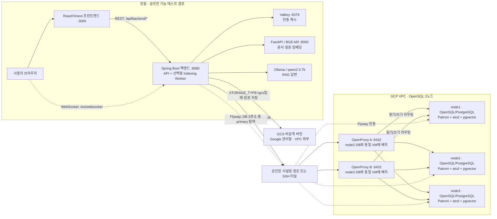

# DocGrid

> 팀의 지식에서 권한을 지키며 근거가 포함된 답을 찾는 오픈소스 문서 검색 워크스페이스

DocGrid는 조직의 PDF·DOCX 문서를 저장·인덱싱하고, 사용자가 열람할 수 있는 문서만 벡터 검색과
RAG 답변에 활용합니다. 문서·컬렉션 관리, 인용 근거, MCP 연동, 인덱싱 상태와 복구 작업을 웹에서
제공합니다. 로컬 개발은 PostgreSQL·MinIO·Valkey로 재현할 수 있습니다. 공모전 기능 테스트는
로컬 프런트엔드·백엔드를 **OpenProxy 2개를 거쳐 OpenSQL 3노드**에 연결하는 경로로 준비합니다.
GCS는 원본 파일 저장소로 선택할 수 있습니다.

## 주요 기능

- **문서 인덱싱 파이프라인**: PDF·DOCX 원본을 저장하고 본문 Parsing, Chunk 분할, BGE-M3 Batch
  Embedding, pgvector 저장을 Worker가 처리합니다. Worker는 환경별로 명시적으로 켭니다.
- **권한 기반 AI 검색**: 사용자·역할·부서와 문서·컬렉션 공개 범위를 검색 전에 적용해 접근 가능한
  문서만 의미 검색합니다.
- **근거가 남는 RAG 답변**: Ollama로 답변을 생성하고 사용한 문서와 Chunk를 인용 근거로 함께 저장하고
  표시합니다.
- **지식 워크스페이스 관리**: 문서 Version, 원본 미리보기·다운로드, 계층형 컬렉션, 직접 권한 부여·회수를
  웹에서 관리합니다.
- **MCP 연동**: 전용 Access Token으로 문서 검색·상세 조회·인덱싱 상태 도구를 제공하고 Rate Limit과
  출력 Sanitization을 적용합니다.
- **RAGOps 운영 화면**: WebSocket으로 Job·Worker 상태를 갱신하고 실패 원인, Retry, Queue·동기화 상태를
  관측하고 복구할 수 있습니다.
- **환경별 저장소와 OpenSQL 연결**: 로컬·MinIO·GCS 저장소 Adapter와 OpenProxy A/B를 통한
  OpenSQL 3노드 연결을 지원합니다. AWS S3 Adapter도 코드에 남아 있지만 현재 GCP 시험 저장소는
  GCS입니다.

## 아키텍처


위 이미지는 초기 개념도입니다. Redis·MinIO·AWS 배포 표시는 이번 OpenSQL 기능 테스트의 실행
배치를 나타내지 않습니다. 아래 그림은 **로컬 프런트엔드·백엔드 1개 → OpenProxy A/B → GCP
OpenSQL DB 3노드**로 진행할 기능 테스트의 목표 경로입니다. 로컬 앱과 원격 3노드를 함께 쓰는
전체 시나리오는 아직 실행 결과로 판정하지 않았습니다.



OpenSQL은 한 시점에 primary 1개와 standby 2개로 운영되며 역할이 바뀔 수 있습니다. 앱의 일반
JDBC는 두 OpenProxy 주소를 사용하고, **Flyway만** 별도 계정으로 DB 3주소 중 현재 primary를
찾습니다. `loadBalanceHosts=true`는 새 JDBC 연결이 사용할 프록시 후보를 분산하며 HTTP 요청이나
SQL을 균등하게 나누는 설정이 아닙니다. Patroni는 각 노드의 역할과 복제를 관리하고, 세 노드에
배치된 etcd는 정족수 2/3으로 상태를 조정합니다. GCS는 VPC 안의 VM 디스크가 아닌 Google
관리형 버킷입니다.

| 구분 | 확인한 상태 | 기능 테스트에서 확인할 내용 |
|---|---|---|
| DB·프록시 | GCP OpenSQL 3노드와 OpenProxy A/B의 개별 연결·라우팅은 검증됨 | 로컬 백엔드의 업로드·검색·인덱싱이 이 경로에서 끝까지 동작하는지 |
| 원본 저장소 | GCS Adapter와 GCP 앱의 PDF 업로드·재조회는 각각 검증됨 | 로컬 백엔드와 OpenSQL 3노드를 함께 사용할 때 GCS 저장·조회가 일치하는지 |
| AI·캐시 | 로컬 Compose는 FastAPI/BGE-M3·Valkey를, Ollama는 별도 프로세스를 사용 | 위 조합의 전체 기능 흐름과 실패·복구 동작 |

프런트엔드 REST는 `BACKEND_API_URL`로 로컬 백엔드에 전달되고, 브라우저 WebSocket은
`NEXT_PUBLIC_BACKEND_WS_URL`로 직접 연결됩니다. GCP의 **백엔드 A/B·내부 HTTP 로드 밸런서**는
별도로 수행한 부하·장애 시험의 환경입니다. 아래 표에서는 그 시험의 실제 경로를 정확히 적되,
이번 기능 테스트의 필수 구성으로 표시하지 않습니다.

### 문서와 검색의 내부 흐름

1. `DocumentUploadFacade`가 파일 형식·해시를 확인하고 선택된 저장소에 원본을 기록한 다음,
   `opensql-ha` 프로필에서 OpenProxy 경유 DB 트랜잭션으로 문서·버전·인덱싱 Job을 만듭니다.
   DB 저장 실패 시 미사용 객체 삭제를 시도합니다.
2. `INDEXING_WORKER_ENABLED=true`인 백엔드가 Job을 선점하고 원본을 읽어 Parsing·Chunking →
   FastAPI/BGE-M3 Embedding → pgvector 저장을 진행합니다. Lease 갱신·재시도·복구 상태는 DB에 남습니다.
3. `SearchFacade`는 질문을 임베딩한 뒤 문서 권한을 먼저 거르고, pgvector 후보를 조회한 후 권한을
   다시 확인합니다. RAG Worker는 검색 문맥을 Ollama에 보내 답변과 인용을 저장합니다.
4. 단일 로컬 백엔드는 자체 STOMP SimpleBroker에서 대시보드 메시지를 전송합니다. 여러 백엔드를
   실행할 때는 공용 캐시의 Pub/Sub 갱신 신호와 별도의 다중 인스턴스 검증이 필요합니다.

## 기술 스택

| 영역 | 기술 |
|---|---|
| Backend | Java 17, Spring Boot 3.5.16, Spring Security, Spring Data JPA, Spring AI MCP, WebSocket, Flyway |
| Frontend | React 19, TypeScript 5, Tailwind CSS 4, Vinext, Vite |
| Database | OpenSQL 17.8, PostgreSQL 17, pgvector 0.8.1 |
| AI | BAAI/bge-m3, Ollama, qwen2.5:7b |
| Storage | GCS (GCP), MinIO (로컬), Local Filesystem, 선택형 AWS S3 Adapter |
| Cache | Valkey 9.1 (로컬 Compose), Spring Data Redis 클라이언트; GCP 공용 VM은 전환 전 Redis 6.2 확인 |
| Observability | RAGOps Dashboard, Prometheus, Alertmanager, Grafana (로컬 monitoring profile) |
| Test | JUnit 5, Gradle, Node.js Test Runner |

## 빠른 실행

아래는 GCP 접근 권한 없이 로컬 PostgreSQL·MinIO·Valkey로 핵심 기능을 확인하는 경로입니다.
명령은 저장소 루트에서 실행합니다.

### 1. 사전 준비

- Git
- Java 17
- Node.js 22.13.0 이상
- Docker Desktop과 Docker Compose
- RAG 답변까지 확인하려면 Native Ollama

### 2. Clone과 환경 변수

```bash
git clone https://github.com/DocGrid/docgrid.git
cd docgrid
cp .env.example .env
cp frontend/.env.example frontend/.env.local
npm --prefix frontend ci
```

`.env.example`은 로컬 PostgreSQL·MinIO 접속값을 제공하지만 인덱싱 Worker는 기본값으로 **꺼져
있습니다**. 업로드 후 자동 인덱싱까지 확인하려면 로컬 `.env`에
`INDEXING_WORKER_ENABLED=true`를 추가합니다. 실제 운영 비밀번호와 외부 서버 인증정보는 README,
Issue 또는 Commit에 기록하지 않습니다.

### 3. PostgreSQL, MinIO, Valkey, BGE-M3 실행

```bash
docker compose up -d --build postgres minio valkey embedding-server
docker compose logs -f embedding-server
```

BGE-M3는 첫 실행 시 모델 다운로드와 로딩이 필요하므로 준비 완료 로그를 확인합니다. 소요 시간은
호스트와 네트워크에 따라 다릅니다. `Ctrl+C`로 로그 조회만 종료한 뒤 Health Check를 실행합니다.

```bash
curl -f http://localhost:8000/health/ready
curl -f http://localhost:9000/minio/health/live
```

### 4. Ollama 실행

최종 RAG 답변 생성에는 `qwen2.5:7b`가 필요합니다. Ollama를 운영체제에 맞게 Native로 설치한 뒤
모델을 준비합니다. macOS에서는 다음 명령을 사용할 수 있습니다.

```bash
brew install ollama
brew services start ollama
ollama pull qwen2.5:7b
ollama run qwen2.5:7b "안녕"
```

초기 설치 후 재기동할 때는 Valkey, BGE-M3, Ollama를 전용 스크립트로 기동하고 연결 상태를 확인할 수
있습니다. 위의 `docker compose up`와 같은 서비스를 다시 시작하는 명령이므로 둘 중 한 경로를 선택합니다.

```bash
./scripts/local-services.sh start
./scripts/local-services.sh status
```

`start`는 BGE-M3 준비 완료까지 최대 15분 기다리며, 실패하면 서비스별 복구 명령을 출력합니다.

Apple Silicon에서는 `ollama ps`의 `PROCESSOR`가 GPU인지 확인합니다. 설치와 성능 관련 상세 내용은
[백엔드 실행 문서](backend/README.md#ollama-rag-llm-서버)를 참고하세요.

### 5. Backend와 Frontend 실행

각 명령을 별도 Terminal에서 실행합니다.

```bash
./backend/gradlew -p backend bootRun
```

```bash
npm --prefix frontend run dev
```

- Web: `http://localhost:3000`
- API 문서: `http://localhost:8080/swagger-ui/index.html`
- OpenAPI JSON: `http://localhost:8080/v3/api-docs`

Backend와 Embedding Provider의 운영 메트릭을 함께 수집하려면 선택형 monitoring profile을 실행합니다.

```bash
docker compose --profile monitoring up -d prometheus alertmanager
```

Prometheus는 감시 대상이나 Alertmanager의 health 상태를 시작 조건으로 사용하지 않는다. 따라서
Embedding Provider가 준비되지 않아도 먼저 기동해 수집 실패와 경보를 기록한다.

- Prometheus Target: `http://localhost:9090/targets`
- 설정과 기존 Prometheus 연결: [monitoring/prometheus/README.md](monitoring/prometheus/README.md)

### 6. 핵심 흐름 확인

1. 회원가입 또는 로그인
2. PDF/DOCX 문서 업로드
3. `INDEXING_WORKER_ENABLED=true`일 때 문서 인덱싱 상태가 완료로 바뀌는지 확인
4. 문서 내용으로 AI 검색
5. RAG 답변과 인용 근거 확인

### 종료

```bash
docker compose stop postgres minio valkey embedding-server
# macOS에서 Homebrew로 Ollama를 실행한 경우
brew services stop ollama
```

`docker compose down -v`는 DB·Object·모델 Cache Volume을 삭제할 수 있으므로 일반적인 종료에는 사용하지
않습니다.

## 환경 선택

파일 저장소는 `STORAGE_TYPE`으로 하나만 선택합니다. API와 Worker는 반드시 같은 저장소 설정을 사용해야
하며, 저장소 변경은 기존 파일을 자동으로 이전하지 않습니다.

| `STORAGE_TYPE` | 용도 | 주요 설정 |
|---|---|---|
| `local` | 별도 Object Storage 없는 단일 실행 환경 | `STORAGE_LOCAL_ROOT`, `STORAGE_BUCKET` |
| `minio` | 기본 Docker 개발 환경 | `MINIO_ENDPOINT`, Credential, `STORAGE_BUCKET` |
| `s3` | 코드에 남아 있는 선택형 Adapter; 현재 GCP 저장소에는 미사용 | `AWS_REGION`, AWS Credential, `STORAGE_BUCKET` |
| `gcs` | Google Cloud Storage 환경 | ADC 인증, `STORAGE_BUCKET` |

GCS를 선택할 때는 실행 주체에 대상 Bucket의 Object 생성·조회·삭제 권한을 부여하고
`STORAGE_TYPE=gcs`, `STORAGE_BUCKET`을 설정합니다. 로컬에서는 Application Default Credentials를,
Google Cloud 실행 환경에서는 연결된 Service Account를 사용합니다. 서비스 계정 키는 `.env`에 넣지 않습니다.
기존 MinIO/S3 파일의 DB 위치는 GCS로 자동 이전되지 않으므로, 기존 파일이 있는 환경은 파일과 DB 위치를
이전하기 전까지 저장소 설정만 바꾸지 않아야 합니다.

### OpenSQL 3노드 연결

로컬 백엔드에서 GCP의 OpenSQL 3노드를 사용할 때는 `SPRING_PROFILES_ACTIVE=opensql-ha`
프로필을 사용합니다. 실제 주소·자격증명은 이 저장소에 두지 않고 실행 환경에 주입합니다.

| 설정 | 연결 대상·역할 |
|---|---|
| `OPENSQL_APP_JDBC_URL` | OpenProxy A/B의 다중 호스트 JDBC URL. 신규 연결의 프록시 후보를 선택합니다. |
| `OPENSQL_APP_USER`, `OPENSQL_APP_PASSWORD` | 최소 권한 애플리케이션 계정. |
| `OPENSQL_MIGRATION_JDBC_URL` | DB node1/2/3의 다중 호스트 JDBC URL과 `targetServerType=primary`. Flyway 전용 경로입니다. |
| `OPENSQL_MIGRATION_USER`, `OPENSQL_MIGRATION_PASSWORD` | 앱 계정과 분리된 DDL 마이그레이션 계정. |
| `STORAGE_TYPE=gcs`, `STORAGE_BUCKET` | GCS 버킷과 로컬 실행 주체의 Application Default Credentials. GCP VM에서는 연결된 서비스 계정을 사용합니다. |
| `REDIS_HOST`, `REDIS_PORT`, `REDIS_PASSWORD` | 로컬 백엔드가 사용할 Valkey의 Redis 프로토콜 주소. 변수명과 Spring Data Redis 클라이언트는 유지됩니다. |
| `DASHBOARD_CROSS_NODE_ENABLED` | 단일 백엔드 기능 테스트에서는 기본값 `false`. 다중 백엔드 시험에서만 공용 캐시 Pub/Sub를 사용하도록 `true`로 설정합니다. |
| `EMBEDDING_SERVER_URL`, `OLLAMA_SERVER_URL` | 로컬 백엔드가 접근할 수 있는 FastAPI/BGE-M3와 Ollama 주소. 로컬 기본값은 각각 `http://localhost:8000`, `http://localhost:11434`입니다. |

앱·프록시·DB 연결 계약은
[OpenProxy/Hikari 실접속 기록](docs/test-results/gimin-opensql-openproxy-hikari-troubleshooting-20260924.md)과
[`application-opensql-ha.yml`](backend/src/main/resources/application-opensql-ha.yml)에 있습니다.
로컬에서 GCP DB에 접속할 때는 승인된 SSH 터널과 전용 자격증명이 필요하며, DB 포트를 인터넷에
공개하는 실행법은 제공하지 않습니다. 공급사 설치 파일, 라이선스, DB 자격증명과 SSH 키도 저장소에
포함하지 않습니다.
macOS 팀원별 터널 자동 시작 절차는 [로컬 OpenSQL SSH 터널 가이드](docs/runbooks/opensql-local-tunnels.md)를 따릅니다.

## 테스트

일반 회귀 테스트는 외부 장시간 Benchmark와 실제 인프라 E2E를 제외하지만 PostgreSQL과 Valkey를
사용하는 통합 테스트를 포함합니다. 두 Service를 먼저 준비합니다.

```bash
docker compose up -d --wait postgres valkey
./backend/gradlew -p backend test
npm --prefix frontend test
```

파일 저장소 Adapter와 실제 자동 Worker 전체 흐름은 별도 E2E로 검증합니다.

```bash
docker compose up -d --build --wait postgres minio valkey embedding-server

DB_HOST=127.0.0.1 DB_PORT=55432 \
  ./backend/gradlew -p backend storageWorkerE2eTest
```

## OpenSQL 핵심 부하·장애 검증

공모전에서 보여 줄 수 있는 **OpenSQL 3노드의 실제 앱 쓰기 부하와 장애 대응**을 중심으로
정리했습니다. 아래 결과는 실행 시점·환경이 서로 달라 하나의 서비스 가용성 수치로 합칠 수 없습니다.

| 시험 | 실행 조건 | 관측 결과와 한계 | 실행 기록 |
|---|---|---|---|
| **정상 쓰기 부하** | GCP 내부 LB → 백엔드 A/B → OpenProxy A/B → OpenSQL 3노드, 150 req/s × 60초 × 3회 | 회차마다 HTTP 201 **9,001건**, DB 누락·중복·실패·드롭 **0건**. 200·250 req/s는 안정 기준선에서 제외 | [GCP HTTP 쓰기 기준선](docs/test-results/gimin-389-opensql-ha-http-write-baseline-20261002.md) |
| **OpenProxy 한쪽 장애** | GCP에서 A와 B를 각각 중단하고, 살아 있는 프록시로 새 JDBC 연결이 이동하는지 측정 | 새 연결 전환은 확인했지만 재실행에서 HTTP 500 **A 3건·B 8건**. 201 응답의 DB 누락·중복은 0건이어도 **무중단 시험은 실패** | [장애 부하](docs/test-results/gimin-391-openproxy-ab-fault-load-20261003.md), [500 원장 재분석](docs/test-results/gimin-393-openproxy-http-500-analysis-20261003.md) |
| **Patroni 계획 역할 전환** | GCP OpenSQL 3노드에서 양방향 계획 switchover 후 이전 리더의 replica 자동 재합류 확인 | streaming 복귀 **19초·18초**, 수동 컨테이너 재시작 0회. HTTP 부하를 건 리더 강제 상실이나 서비스 RTO/RPO 측정은 아님 | [3노드 재합류 검증](docs/test-results/gimin-401-patroni-auto-rejoin-20261003.md) |
| **DB 중단 중 인덱싱 복구** | 과거 커밋의 로컬 OpenSQL 컨테이너 프로세스만 중단·재시작, 앱 JVM과 실제 Worker 유지 | 만료 Lease가 복구되고 두 번째 Attempt에서 문서 `INDEXED`, Chunk·Vector 중복 0. 현재 커밋의 GCP VM 상실 시험은 아님 | [재연결·Lease 복구 E2E](docs/test-results/gimin-opensql-reconnect-lease-recovery-e2e.md) |
| **복제 지연·권한 안전성** | GCP 3노드 standby 적용을 지연시킨 뒤 ADMIN 회수, OpenProxy 경유 관리자 요청 재시험 | 수정 전 뒤처진 standby 때문에 HTTP 200을 재현했고, 수정 후 primary 확인 경로는 **403**. 일반 API 전체의 최신성 보장은 아님 | [문제 재현](docs/test-results/opensql-permission-replica-lag-20260929.md), [수정 후 검증](docs/test-results/opensql-admin-role-primary-consistency-20261001.md) |

**아직 실행하지 않은 장애 시험:** primary 강제 종료, 리더 VM 상실, etcd 정족수 상실 중 실제
HTTP 쓰기 부하의 RTO/RPO는 측정하지 않았습니다. [사전 점검](docs/test-results/opensql-ha-fault-preflight-20261003.md)은
초기 조건에서 이 장애 주입을 NO-GO로 판정했고, 이후 계획 switchover 결과를 강제 장애 결과로
바꾸어 표현하지 않습니다. SQL 라우팅·설치·호환성 시험과 다른 기능 테스트는
[전체 실행 기록](docs/test-results/)에 보존되어 있습니다.

## 문서

| 문서 | 내용 |
|---|---|
| [Backend README](backend/README.md) | PostgreSQL, BGE-M3, Ollama 실행 |
| [Frontend README](frontend/README.md) | Web 실행, 인증과 API 연결 범위 |
| [로컬 DB 실행](docs/local-db.md) | PostgreSQL 17 + pgvector 로컬 기준선 |
| [설계 문서](docs/design/) | 기능·인프라의 설계 의사결정 |
| [실행 결과](docs/test-results/) | 위 테스트 표의 상세 절차·실행별 증거·제약 |

테스트 표의 각 링크에서 실행 시점, 사용한 환경, 실패·재시도와 원본 증거를 확인할 수 있습니다.

## 저장소 구조

```text
.
├── backend/          # Spring Boot API, Worker와 BGE-M3 서버
├── frontend/         # DocGrid Web Application
├── docs/design/      # 설계 의사결정
├── docs/test-results/# 실행된 Test Plan, 측정과 결과
├── docker/           # 로컬 인프라 초기화
├── monitoring/       # Prometheus 설정과 Alert Rule
├── scripts/          # 검증·보고 자동화
└── docker-compose.yml
```

## 라이선스 및 외부 구성요소

DocGrid의 자체 소스코드와 문서는 [Apache License 2.0](LICENSE)에 따라 배포합니다.

| 외부 구성요소 | 사용 방식 | 라이선스 경계 |
|---|---|---|
| [BAAI/bge-m3](https://huggingface.co/BAAI/bge-m3) | Embedding Server 첫 실행 시 다운로드 | MIT License |
| [qwen2.5:7b](https://ollama.com/library/qwen2.5:7b) | 사용자가 `ollama pull`로 다운로드 | Apache License 2.0 |
| [Ollama](https://github.com/ollama/ollama) | 사용자가 Native로 설치해 `qwen2.5:7b`를 실행 | MIT License |
| OpenSQL | 외부 개발·검증 DB로 연결 | 공급사 배포본과 License는 저장소에 포함하지 않음 |
| Python 의존성 (임베딩 서버) | `backend/embedding-server/requirements.txt`로 설치 | fastapi MIT, uvicorn BSD, FlagEmbedding MIT, torch BSD, transformers·peft Apache-2.0, numpy BSD, prometheus-client Apache-2.0 AND BSD-2-Clause. Linux x86_64에서는 CPU 전용 torch를 설치해 NVIDIA `nvidia-*` 패키지를 설치하지 않음 |
| Java 의존성 | Gradle로 획득 (`backend/build.gradle`) | Apache-2.0·MIT·BSD 위주. Hibernate ORM 6.6은 LGPL-2.1 이상, Logback은 EPL-2.0과 LGPL-2.1 듀얼, Jakarta·AspectJ는 EPL-2.0, 테스트용 H2는 MPL-2.0·EPL-1.0, JUnit은 EPL-2.0 |
| npm 의존성 | npm으로 획득 (`frontend/package-lock.json`) | 실행 의존성 4개는 react·react-dom·scheduler MIT, drizzle-orm Apache-2.0. 나머지는 빌드·개발 도구이며 MIT·Apache-2.0·ISC·BSD 위주이고 MPL-2.0, LGPL-3.0(sharp libvips) 등을 포함 |
| Valkey 9.1 (Container Image) | 로컬 Compose 캐시 서버. Spring Data Redis(Apache-2.0)·Lettuce(MIT) 클라이언트로 접속 | BSD-3-Clause |
| pgvector/pgvector 0.8.1 (Container Image) | 로컬 Compose PostgreSQL 17 | pgvector는 PostgreSQL License. 이미지는 PostgreSQL과 OS 패키지를 포함 |
| Prometheus v3.5.5, Alertmanager v0.33.1 (Container Image) | 선택형 `monitoring` profile | Apache-2.0 |
| Grafana 13.2.3 (Container Image) | 선택형 `monitoring` profile. 수정하지 않고 별도 컨테이너로 실행 | AGPL-3.0 (OSI 승인) |
| MinIO (Container Image) | 로컬 Compose의 `minio` 서비스. 팀은 현재 사용하지 않음(파일 저장소는 GCS). 공식 `minio/minio` 이미지는 2026-10-09 기준 새로 받을 수 없음(`docker pull` 거부 확인) | AGPL-3.0 |

외부 모델, 라이브러리, Container Image와 OpenSQL 배포본은 DocGrid의 Apache License 2.0 적용 범위에
포함되지 않습니다. 위 표의 라이선스는 2026-10-09 기준 각 패키지의 메타데이터(POM·PyPI·npm
lockfile)와 업스트림 라이선스 원문을 확인한 결과이며, 제출·배포 시점에 다시 확인합니다.
